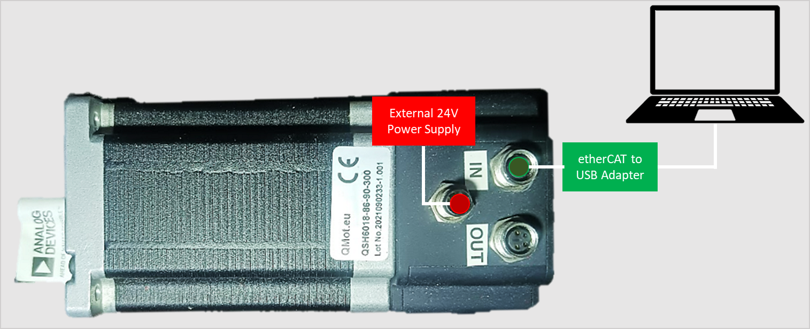

| adi_tmc_coe |
| --- |
Official ROS Driver for Trinamic Motor Controllers (TMC) that uses CANopen-over-etherCAT(CoE) protocol. |

# Background
- Supported TMC boards: [TMCM-1461-CoE](https://www.analog.com/en/products/pd-1461.html)
- Supported communication interface and interface driver: CANopen-over-etherCAT ([SOEM](https://github.com/OpenEtherCATsociety/SOEM))
- Supported ROS and OS distro: Noetic (Ubuntu 20.04)
- Supported platform: Intel x86 64-bit (amd64)
- Supported setup: Single/Multiple TMC in Single ECAT interface (namespace-managed)

> :memo: _Note: Although officially supported TMC boards are only the abovementioned, all market-ready TMCs with YAMLs in this repository are also expected to work and can be tried and tested by the users._
> _Contact the Developers for any  issues encountered._

# Hardware

For the tested TMCM-1461-CoE setup, the following are used:
- 1 x [TMCM-1461-CoE](https://www.analog.com/en/products/pd-1461.html)
- 1 x External 24V power supply
- 1 x USB to LAN ethernet adapter

Also the following:
- 1 x 4pin female M8-RJ45 etherCAT cable
- 1 x 4 pin male M8 power supply cable

The image below shows the connection diagram of the setup (with labels):


The image below shows the actual setup used (for reference):


# Software

## Software Architecture


## Software Dependencies
Assumptions before building this package:
* Installed ROS Noetic. If not, follow these [steps](http://wiki.ros.org/noetic/Installation/Ubuntu).
* Setup catkin workspace (with workspace folder named as "catkin_ws"). If not, follow these [steps](http://wiki.ros.org/ROS/Tutorials/InstallingandConfiguringROSEnvironment#:~:text=you%20installed%20ROS.-,Create%20a%20ROS%20Workspace,-catkin).

Packages installed on rosdep (See [Build](#build))
* ros-noetic-ethercat-grant - accessing network interface, including Ethernet interfaces, often requires root privilege for security reasons. ethercat_grant allows the node to run without root privilege.
* ros-noetic-soem - an EtherCAT master library.

# Clone

In the website:
1. Make sure that the branch dropdown is set to "noetic".
2. Click the "Clone" or "Code" button, then copy the SSH or HTTPS link (eg, "*.git").

In a terminal, do the following:
```bash
$ cd ~/catkin_ws/src
$ git clone <copied SSH o HTTPS link here> adi_tmc_coe #clones repo to "adi_tmc_coe" directory name
```

Note: If you have previously cloned and built v1.0.0 of this package, additionally do the following for clean-up:
```bash
$ cd ~/catkin_ws/src/adi_tmc_coe
$ git pull
$ rm -rf dependencies/ #removes dependencies/ directory as soem will be installed through rosdep install in newer versions
```

# Build

Do proper exports first:
```bash
$ source /opt/ros/<ROS version>/setup.bash
```
Where:
- "ROS version" is the user's actual ROS version

Then, install all required dependencies (See [SoftwareDependencies](#software-dependencies)) using rosdep:
```bash
$ rosdep init
$ rosdep update
$ rosdep install --from-paths src -y --ignore-src
```
Then:
```bash
$ cd ~/catkin_ws/
$ catkin_make clean
$ catkin_make
$ source devel/setup.bash
```

# Pre-Launch (One-time per setup)

Not all Trinamic modules are on TMCL_IDE specially CoE due to different interface used. Check module first for other communication protocol than CoE (UART, USB or CAN). Proceed to next steps if module is available in TMCL_IDE.

> :memo: _Note: Different communication protocol might need different cable to communicate with TMCL_IDE (e.g. UART - USB to TTL adapter, USB - TypeC/TypeB/Micro, CAN - PCAN-USB adapter)._
> 

If it's the first time to use the set of motors for the TMC, it is required to calibrate and tune the PID settings of the motors first.

Do the calibrations/tuning by downloading and using [TMCL-IDE](https://www.analog.com/en/resources/evaluation-hardware-and-software/motor-motion-control-software/tmcl-ide.html).

## BLDC Motors

### Calibrate the motors

For a run-through/tutorial of how the calibration is done in the TMCL-IDE via its `Wizard Pool` feature, check this [link](https://www.youtube.com/watch?v=MASVD_2tNuo).

### Tune the PI settings of the motors

For a run-through/tutorial of how the PI tuning is done in the TMCL-IDE via its `PI Tuning` feature, check this [link](https://www.youtube.com/watch?v=rfZAs-QdYlQ).

> :memo: _Note: For all the calibration and tuning done, store all the parameters set from TMCL_IDE on the board's EEPROM. Do this by doing any of the following:_
> - _Clicking the "Store Parameter" under Settings of each axis_
> - _Using STAP (Store Axis Parameters) command from Direct Mode_
> - _Creating and uploading a TMCL Program, and enabling the "auto start mode" under SGP (Set Global Parameter) command from Direct Mode_
> - - :memo: _Note: Some boards don't have "auto start mode", so in such a case, use the other options to store the parameters._

## Stepper Motors

### Calibrate the motors

For a run-through/tutorial of how the calibration is done in the TMCL-IDE via its `Wizard Pool` feature, check this [link](https://www.youtube.com/watch?v=l6r63Q7Yr58o).

For more information about Trinamic features on stepper motors, visit this [link](https://www.analog.com/en/product-category/stepper-motor-driver.html).

> :memo: _Note: For all the calibration and tuning done, store all the parameters set from TMCL_IDE on the board's EEPROM. Do this by:_
> - _Creating and uploading a TMCL Program, and enabling the "auto start mode" under SGP (Set Global Parameter) command from Direct Mode_

## Config/Launch File

Before launching the package, make sure that the *interface_name* on the yaml file is correct. Modify the corresponding yaml file depending on your setup:

* If using 1 slave with 1 axis, modify 1slave_1axis.yaml,
* If using 2 slaves with 1 axis per slave, modify 2slaves_1axis_per_slave.yaml,
* If using 2 slaves with 2 axes per slave, modify 2slaves_2axes_per_slave.yaml,

Modify *interface_name* (check [Parameter](#parameters)) and set the interface name of your adapter.

To check the interface name, run this command in terminal:
```bash
$ ifconfig
```

Interface name is usually starts with enx / eth. Copy and paste the interface name on the *interface_name* in yaml file.

Also, check the launch file if correct trinamic board autogenerated yaml and config yaml is loaded. TMCM-1461 setup is the default namespace for 1slave_1axis and 2slaves_1axis_per_slave launch files, provide the correct namespace if other device is used.

# Launch
This package has 3 sample launch files for:

single slave with single axis (used module is TMCM-1461-CoE)
```bash
$ roslaunch adi_tmc_coe 1slave_1axis.launch
```
2 slaves with single axis on both slaves (used module is 2x TMCM-1461-CoE)
```bash
$ roslaunch adi_tmc_coe 2slaves_1axis_per_slave.launch
```
2 slaves with 2 axes on both slaves
```bash
$ roslaunch adi_tmc_coe 2slaves_2axes_per_slave.launch
```

# Nodes

## tmc_coe_ros_node

> :memo: _Note: For those with <slave_number> and <motor_number> in the topic names, these are the slave number and motor number respectively. For example, if there are 2 slaves/devices both with single motor used, there should be two published topics for tmc_coe_info, specifically /tmc_coe_info_1_0 for device 1 motor 0 and /tmc_coe_info_2_0 for device 2 motor 0._

### Published topics

These are the default topic names, topic names can be modified as a ROS parameter.

+ **/tmc_coe_info_<slave_number>_<motor_number> (adi_tmc_coe/TmcCoeInfo)**
    - Data containing:
      + (1) interface name
      + (2) slave number
      + (3) motor number
      + (4) mode of operation
      + (4) status word
      + (5) velocity (if [Parameter](#parameters) wheel_diameter is set to 0, the unit for published velocity is **rpm**, else **m/s**)
      + (6) position (if Position Scaler and Encoder steps are not available as device parameter, the unit for published position is **steps**, else **degree angle**)
      + (7) torque (**mA**)

### Subscribed topics

+ **/cmd_vel_<slave_number>_<motor_number>** (geometry_msgs/Twist) 
    - Velocity command (rpm or m/s)
+ **/cmd_abspos_<slave_number>_<motor_number>** (std_msgs/Int32)
    - Absolute position command (steps or degree angle)
+ **/cmd_relpos_<slave_number>_<motor_number>** (std_msgs/Int32)
    - Relative position command (steps or degree angle)


### Advertised services

+ **/read_SDO** (adi_tmc_coe/read_write_SDO)
    - Executes a read command using SDO protocol
    - The output contains raw data (velocity = rpm, position = steps) from the board. *Do not expect same unit from the publisher.*

| ROS Data Type | Name  | Description | Input |
--- | --- | ---| ---|
**req** | --- | ---| ---|
uint8 |slave_number|Slave number of the selected devicie. The count should start with "1"| 1-255 |
string |object_name|Object Name of the Parameter|Check the autogenerated yaml of the used module and use the obj_name|
string | value |Not required since it will only read the SDO| |
**res** | --- | ---| ---|
int32 | output |Returns the actual value of the parameter| |
bool | result |Returns true if successful, false if an error occurs (wrong input/s, data not received correctly)| |

+ **/write_SDO** (adi_tmc_coe/read_write_SDO)
    - Executes a write command using SDO protocol
    - The input value should be the default unit (velocity = rpm, position = steps) from the board. *Do not expect same unit from the publisher.*

| ROS Data Type | Name  | Description | Input |
--- | --- | ---| ---|
**req** | --- | ---| ---|
uint8 |slave_number|Slave number of the selected devicie. The count should start with "1"| 1-255 |
string |object_name|Object Name of the Parameter|Check the autogenerated yaml of the used module and use the obj_name|
string | value |Input value to write in SDO|Integer in string form. Check the object limits on device's firmware manual. e.g. [TMCM-1461](https://www.analog.com/media/en/dsp-documentation/software-manuals/PD60-4H-1461_CoE_firmware_manual_Fw1.00_Rev1.00.pdf)|
**res** | --- | ---| ---|
int32 | output |Returns the actual value of the parameter| |
bool | result |Returns true if successful, false if an error occurs (wrong input/s, data not sent correctly)| |

+ **/read_PDO** (adi_tmc_coe/read_write_PDO)
    - Executes a read command using PDO protocol. 
    - The output contains raw data (velocity = rpm, position = steps) from the board. *Do not expect same unit from the publisher.*

| ROS Data Type | Name  | Description | Input |
--- | --- | ---| ---|
**req** | --- | ---| ---|
uint8 |slave_number|Slave number of the selected device. The count should start with "1"| 1-255 |
string |cmd|Command available in PDO to read| "modes of operation display", "statusword", "actual velocity", "demand velocity", "actual position", "demand position", "actual torque", "demand torque"|
int32 | value |Not required since it will only read the PDO| |
**res** | --- | ---| ---|
int32 | actual_value |Returns the actual value of the PDO| |
bool | result |Returns true if successful, false if an error occurs (wrong input/s)| |

+ **/write_PDO** (adi_tmc_coe/read_write_PDO)
    - Executes a write command using PDO protocol
    - The input value should be the default unit (velocity = rpm, position = steps) from the board. *Do not expect same unit from the publisher.*

| ROS Data Type | Name  | Description | Input |
--- | --- | ---| ---|
**req** | --- | ---| ---|
uint8 |slave_number|Slave number of the selected device. The count should start with "1"| 1-255 |
string |cmd|Command available in PDO to read| "modes of operation", "controlword", "target velocity", "target position", "target torque"|
int32 | value |Input value to write in PDO|Check the object limits on device's firmware manual. e.g. [TMCM-1461](https://www.analog.com/media/en/dsp-documentation/software-manuals/PD60-4H-1461_CoE_firmware_manual_Fw1.00_Rev1.00.pdf)|
**res** | --- | ---| ---|
int32 | actual_value |Returns the actual value of the PDO| |
bool | result |Returns true if successful, false if an error occurs (wrong input/s)| |

+ **/state_change** (adi_tmc_coe/state_change)
    - Changes state of the specified device/slave

| ROS Data Type | Name  | Description | Input |
--- | --- | ---| ---|
**req** | --- | ---| ---|
uint8 |slave_number|Slave number of the selected device. The count should start with "1"| 1-255 |
string |request_state|Requested state of the device| "init", "preop", "safeop", "operational". Check the [NMT state diagram](https://infosys.beckhoff.com/english.php?content=../content/1033/el32xx/1036980875.html&id=) for correct sequence.|
**res** | --- | ---| ---|
string | current_state |Returns the current state of the device| |
bool | result |Returns true if successful, false if an error occurs (wrong input/s, wrong sequence)| |

+ **/cyclic_sync_mode** (adi_tmc_coe/CSx_mode)
    - Controls the motor's velocity, position or torque in cyclic synchronous mode.
    - The input value should be the default unit (velocity = rpm, position = steps) from the board. *Do not expect same unit from the publisher.*

| ROS Data Type | Name  | Description | Input |
--- | --- | ---| ---|
**req** | --- | ---| ---|
uint8 |slave_number|Slave number of the selected device. The count should start with "1"| 1-255 |
string |CS_cmd|Cyclic Synchronous Modes| "csp" - Cyclic Synchronous Position, "csv" - Cyclic Synchronous Velocity, "cst" - Cyclic Synchronous Torque|
uint8 |interpolation_time_period|Sets the delay for every cycle of data sent| 1-255|
string |interpolation_time_index|Index for interpolation time period where the value increases by the factor of 10| -3-3|
int32[] |value|Set of values to be sent to the device|array/vector of int32|
**res** | --- | ---| ---|
bool | result |Returns true if successful, false if an error occurs (wrong input/s)| |

### Parameters

> :memo: _Notes:_
> - _Communication Interface Parameter is essential in initializing etherCAT.
> - _The node is expected to exit if interface_name is not set/declared, the rest of parameters are okay if not set/declared, default values will be used. _
> - _ROS parameters can only cover `rosparam get`. `rosparam set` is prohibited, even when the user run `rosparam set`, only the parameters from server will change but not in the node itself_

##### _Communication Interface Parameter_

+ **interface_name** (string)
    - Name of the NIC (Network Interface Card) detected by the PC. Use command `$ifconfig` to check the interface name, it usually starts with ethxxx or enxxxx.
+ **SDO_PDO_retries** (int, default: 3) 
    - Indicates how many times the SDO and PDO will retry in sending before logging an error if SDO or PDO fails.
+ **interface_timeout** (double, default: 3.0) 
    - Indicates how long should the node will wait for the slave to be responsive.

##### _TMC COE ROS Node Parameters_

+ **en_slave** (int[], default: [0])
    - Enables/disables device/slave connected. If disabled, settings for those motors will be ignored or not set.
+ **adhoc_mode** (int[], default: [0])
    - This mode expects that the used module is not known. The velocity, position and torque relies on the additional_ratio_* values.
+ **en_motors** (int[], default: [0])
    - Enables/disables active motors or axes. If disabled, settings for those motors will be ignored or not set.

##### _Motor Configuration Settings_
+ **pub_rate_tmc_coe_info** (float, default: 10)
    - Publish rate (hertz) of TMC information
+ **en_pub_tmc_coe_info** (bool, default: false)
    - Enables/disables publishing of TMC information
+ **pub_actual_vel** (bool, default: false)
    - Enable/Disable actual velocity that the user can optionally publish every publish rate as long as en_pub_tmc_info is true
+ **pub_actual_pos** (bool, default: false)
    - Enable/Disable actual position that the user can optionally publish every publish rate as long as en_pub_tmc_info is true
+ **pub_actual_trq** (bool, default: false)
    - Enable/Disable actual torque that the user can optionally publish every publish rate as long as en_pub_tmc_info is true
+ **tmc_coe_info_topic** (string, default: /tmc_coe_info_<slave_number>_<motor_number>)
    - tmc_coe_info topics that will contain chosen TMC info that will be published
+ **tmc_cmd_vel_topic** (string, default: /cmd_vel_<slave_number>_<motor_number>)
    - Twist topics that will be the source of target velocity to be set on the TMC
+ **tmc_cmd_abspos_topic** (string, default: /cmd_abspos_<slave_number>_<motor_number>)
    - Int32 topics that will be the source of target position to be set on the TMC
+ **tmc_cmd_relpos_topic** (string, default: /cmd_relpos_<slave_number>_<motor_number>)
    - Int32 topics that will be the source of target position to be set on the TMC

+ **wheel_diameter** (float, default: 0)
    - Wheel diameter that is attached on the motor shaft directly. This is to convert linear values to rpm
    - If wheel diameter is 0, cmd_vel is equal to rpm
+ **additional_ratio_vel** (float, default: 1)
    - Additional Ratio for velocity for general purposes (adhoc mode, added pulley or gear trains). Default value 1 means disabled
+ **additional_ratio_pos** (float, default: 1)
    - Additional Ratio for position for general purposes (adhoc mode, added pulley or gear trains). Default value 1 means disabled
+ **additional_ratio_trq** (float, default: 1)
    - Additional Ratio for torque for general purposes (adhoc mode). Default value 1 means disabled 

# Quick Tests

### Test Velocity Mode

To do a quick test of Velocity Mode, there is a fake velocity script that the user can run.
Idea is, this script will send Velocity commands (as a ROS topic), then the first motor should be expected to:
1. Increase velocity every 3secs, clockwise (in m/s: 3, 6, 9)
2. Stop for 5secs
3. Increase velocity every 3secs, counter-clockwise (in m/s: -3, -6, -9)
4. Stop for 5secs

To proceed with the test, execute these following commands on three (3) different terminals (in sequence):

| Terminal 1 | Terminal 2  | Terminal 3|
--- | --- | ---|
| <pre>$ cd ~/catkin_ws/ <br>$ source /opt/ros/noetic/setup.bash <br>$ source devel/setup.bash <br>$ roslaunch adi_tmc_coe 1_single_axis_device.launch | <pre>$ cd ~/catkin_ws/ <br>$ source /opt/ros/noetic/setup.bash <br>$ source devel/setup.bash <br>$ rostopic echo /tmc_coe1/tmc_info_1_0 | <pre>$ cd ~/catkin_ws/src/adi_tmc_coe/scripts <br>$ sudo chmod 777 fake_cmd_vel.sh <br>$ ./fake_cmd_vel.sh |

**Monitor the velocity of the first motor (watch out for velocity value at Terminal 2).**

> :memo: _Notes:_
> - _Terminals 2 and 3 are best viewed side-by-side._
> - _You may Ctrl-C the command in Terminal 2 once you're done._
> - _The command in Terminal 3 auto-stops by itself._

### Test Position Mode
To do a quick test of Position Mode, there is a fake position script that the user can run.
Idea is, this script will send Position commands (as a ROS topic), then the first motor should be expected to:
1. Rotate 360 degrees (clockwise) every 5 secs, 3 times
2. Stop for 5secs
3. Rotate 360 degrees (counter-clockwise) every 5 secs, 3 times
4. Stop for 5secs

To proceed with the test, execute these following commands on three (3) different terminals (in sequence):

| Terminal 1 | Terminal 2  | Terminal 3|
--- | --- | ---|
|<pre>$ cd ~/catkin_ws/ <br>$ source /opt/ros/noetic/setup.bash <br>$ source devel/setup.bash <br>$ roslaunch adi_tmc_coe 1_single_axis_device.launch | <pre>$ cd ~/catkin_ws/ <br>$ source /opt/ros/noetic/setup.bash <br>$ source devel/setup.bash <br>$ rostopic echo /tmc_coe1/tmc_info_1_0 | <pre>$ cd ~/catkin_ws/src/adi_tmc_coe/scripts <br>$ sudo chmod 777 fake_cmd_pos.sh <br>$ ./fake_cmd_pos.sh |

**Monitor the position of the first motor (watch out for position value at Terminal 2).**

> :memo: _Notes:_
> - _Terminals 2 and 3 are best viewed side-by-side._
> - _You may Ctrl-C the command in Terminal 2 once you're done._
> - _The command in Terminal 3 auto-stops by itself._

# Miscellaneous

Before doing any of the steps here, please make sure that you already did atleast the [`Build`](#-Build) section above.

## Using a TMC without YAML/Launch files

Per each TMC, a combination of one (1) autogenerated YAML file, (2) EXT YAML file, and (3) launch file are needed to run or test it with adi_tmc_coe. By theory, TMCs listed in autogenerated are all expected to work, however, the fully tested ones (ie, the ones we have hardware setup) are  listed in the [`Background`](#-Background) section.

In case the TMC you have doesn't have any YAMLs/launch, generate the autogenerated (1) autogenerated YAML file, (2) Reuse 1_single_axis_device yaml and launch files (or modify if it has 2 or more axis),then use the _*adhoc*_ mode.

This may be done for a quick test and is not meant to be used long-term. You can do this provided you were able to tune/calibrate that particular TMC using TMCL-IDE (if possible), and you understand and have set the additional_ratio_* parameters in the EXT YAML file.

# Limitations
1. Current modules that are tested does not include Profile Torque Mode but still included on topic names for ease of implementation if decided to continue.
2. Homing Mode is not implemented.
3. Cyclic Synchronous Modes only accepts raw value (no conversions of unit) and is not the same with subscriber callbacks.
4. Host PC specifications play a crucial role to ensure low latency when exchanging data. 4 or more cores are recommended. Threads will increase depending on the number of devices/slaves and motors.
5. Due to having and allowing multiple threads (e.g. 1 thread for processdata cycle, 1 thread that executes SDOread/write), a ~0.01s delay was added in each SDOread/write retries to ensure proper processing.

# License
This project is licensed under the [BSD-3 Clause](LICENSE).

# Notice
Please refer to the [NOTICE](NOTICE) file for details on third-party libraries and attributions.

# Support

Please contact the `Maintainers` if you want to use this ROS Driver on Trinamic Motor Controllers without YAML files in this repository.

Any other inquiries and support are also welcome.
